# 📋 Taskaya

Taskaya is your ultimate to-do list app designed to help you stay organized, prioritize tasks, and boost your productivity. Whether you have simple daily tasks or complex projects, Taskaya has you covered.

---

## 📱 Features

- **Task Management**: Create, update, and delete tasks effortlessly.
- **Search and Filter**: Quickly locate tasks with keyword search and filters.
- **Prioritization**: Assign priorities to focus on important tasks.
- **Progress Tracking**: Visualize your progress and completed tasks.

---

## 🛠️ Tech Stack

- **Programming Languages**: Kotlin
- **Architecture**: MVVM (Model-View-ViewModel)
- **UI Framework**: Jetpack Compose & Material Design
- **Database**: Firebase Firestore
- **Authentication**: Firebase Authentication (Google Sign-In, Email/Password)
- **State Management**: LiveData, ViewModel

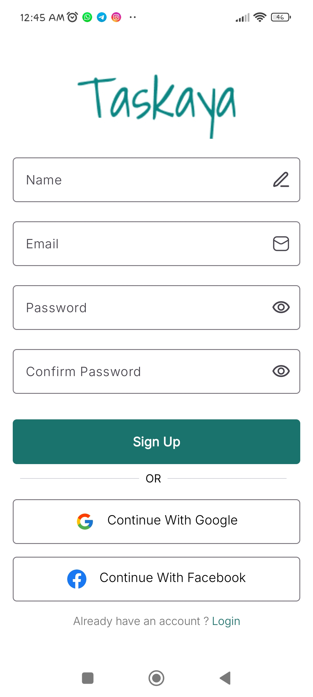  
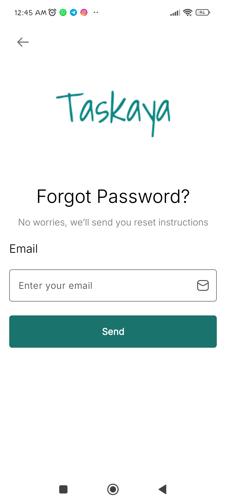  
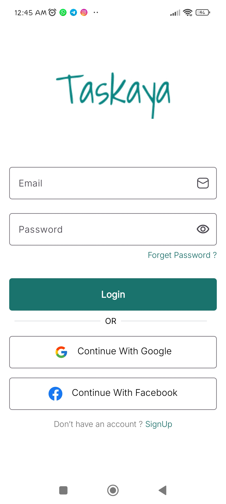  
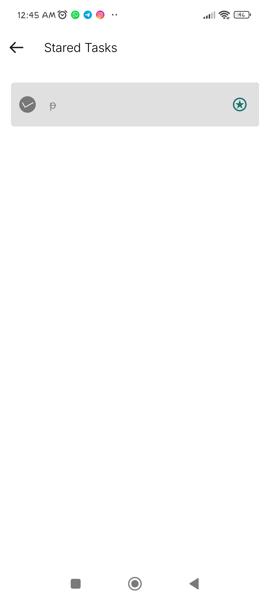  
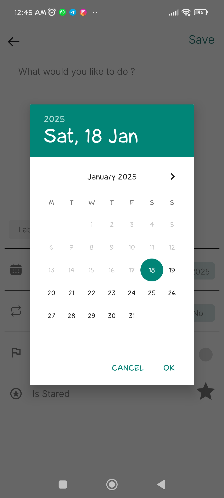  
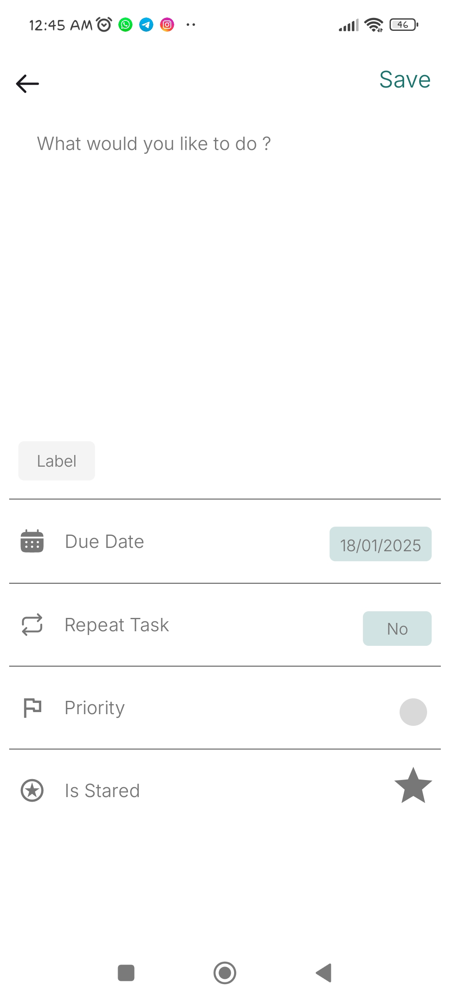  
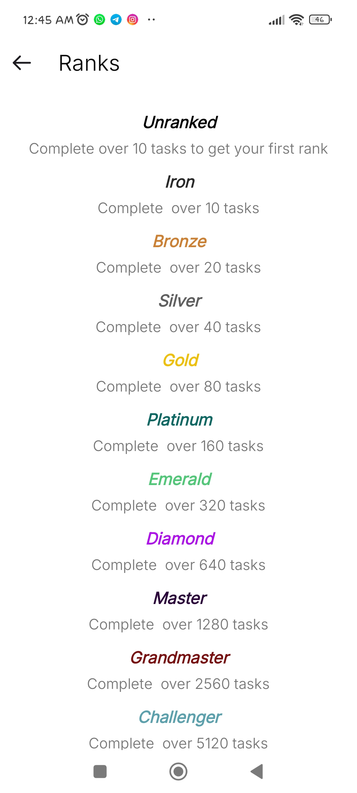  
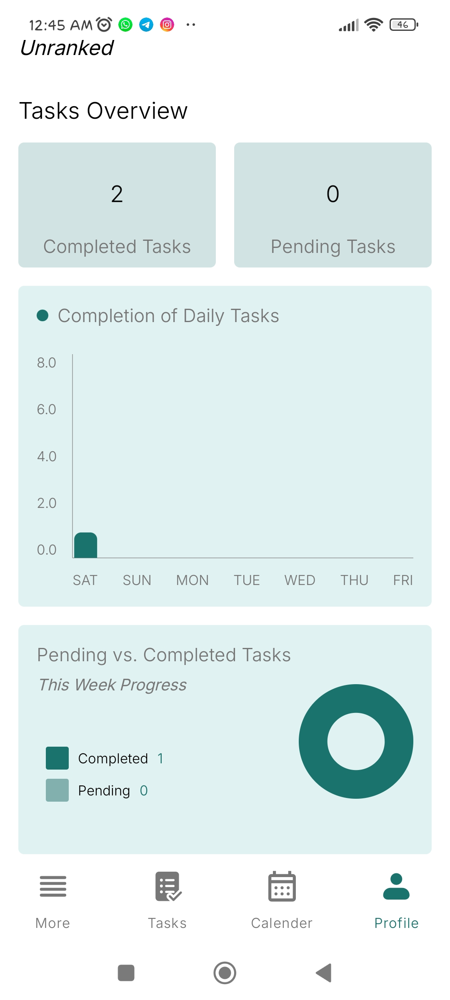  
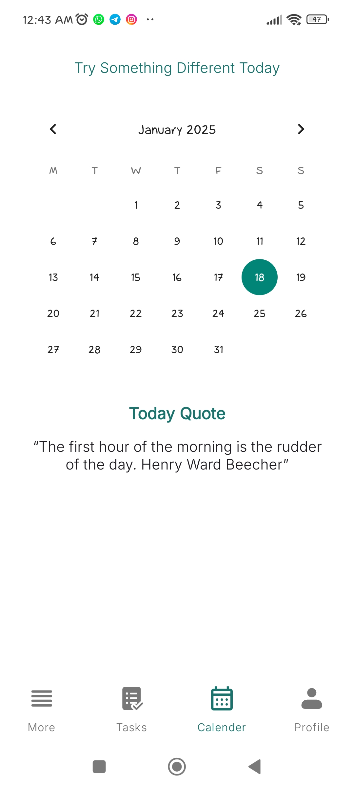  
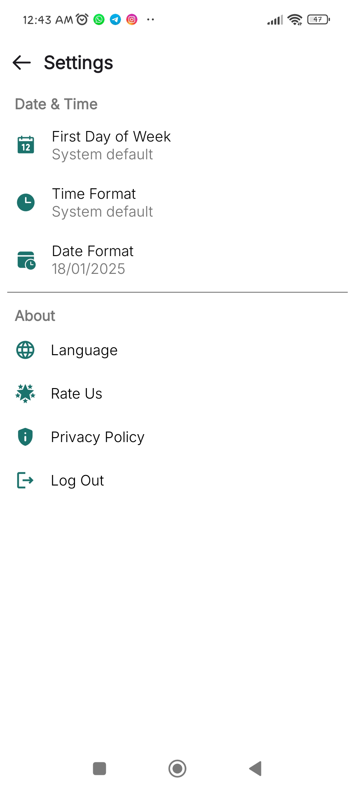  
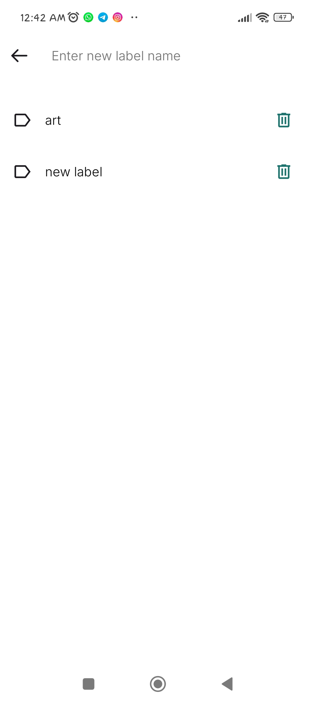  
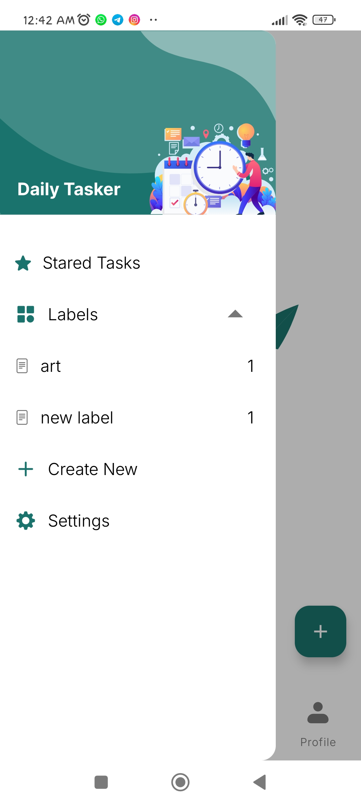  
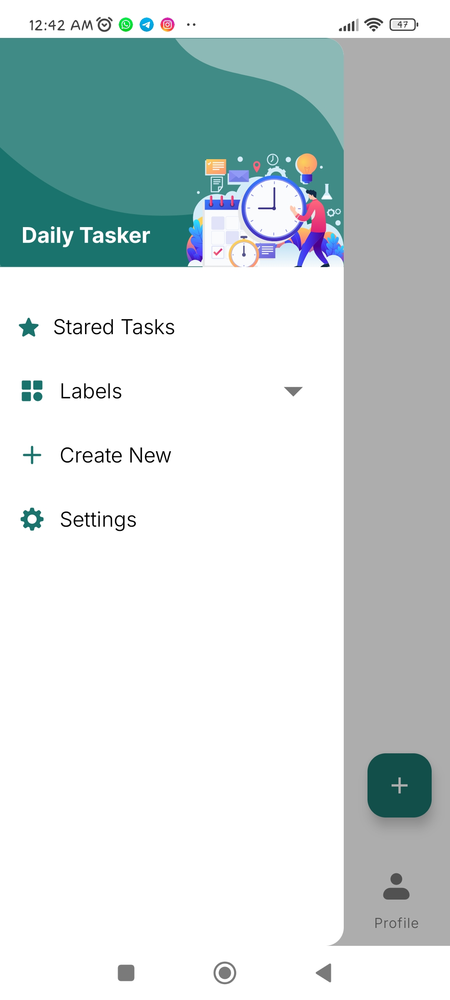

## 🚀 Getting Started

### Prerequisites
- Android Studio installed (version 2022.1 or later).
- Firebase project configured for Firestore, Authentication.
- Minimum SDK 21, Target SDK 34.
